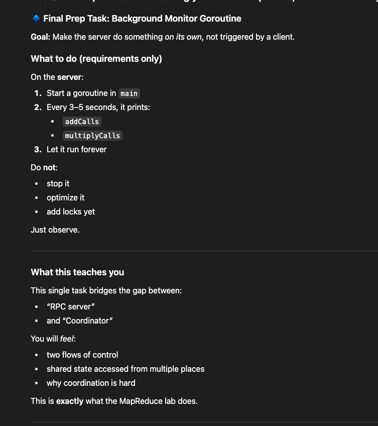

# Go Distributed Playground
High Perf URL shortener in Go

This repo also contains my initial understanding on go syntaxes around structs and pointers

# Next Piece of TO-DO before tackling the lab :
 -- Refer to image.png